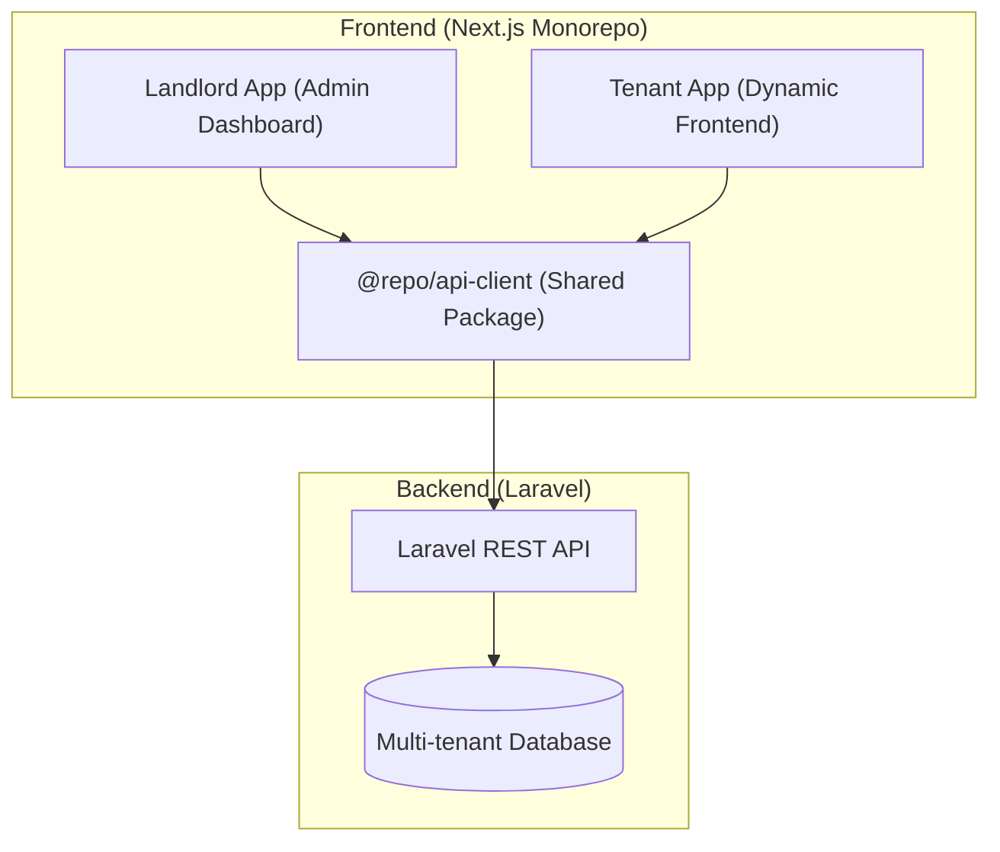
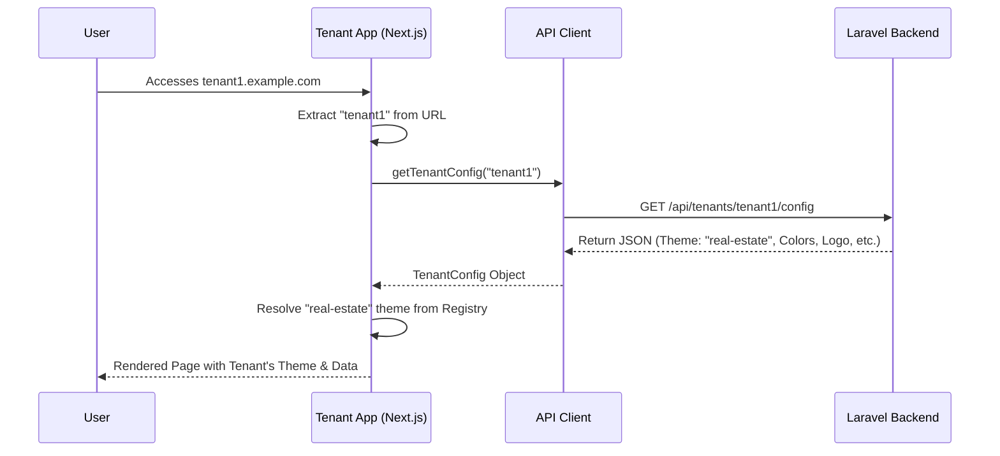
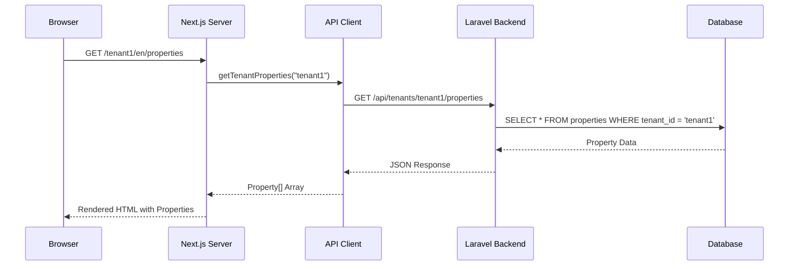

# Backend Integration Architecture Analysis

This document explains the multi-tenant architecture and backend integration strategy for the Landlord (Admin) and Tenant (Frontend) applications.

## 1. System Overview

The system is built as a multi-tenant SaaS platform where a central **Landlord** application manages multiple **Tenant** websites. All communication happens through a shared **API Client** package that talks to a **Laravel Backend**.



---

## 2. Landlord vs. Tenant Roles

### Landlord Application (`apps/landlord`)
The Landlord app is the "Control Plane" of the platform. It is used by the platform owners to manage the entire ecosystem.

**Key Responsibilities:**
- **Tenant Management**: Creating new tenants, managing their domains, and monitoring their status.
- **Theme Management**: Defining available themes and their configurations.
- **Subscription & Billing**: Managing price plans and payments.
- **Global Settings**: Configuring system-wide defaults, languages, and notifications.

### Tenant Application (`apps/tenant`)
The Tenant app is the "Data Plane". It is a single Next.js application that dynamically transforms itself based on the domain it's being accessed from.

**Key Responsibilities:**
- **Dynamic Rendering**: Resolving the correct theme and layout based on tenant configuration.
- **Content Delivery**: Displaying properties, compounds, and blog posts specific to the tenant.
- **Lead Generation**: Handling contact forms and expert advice requests for the tenant.

---

## 3. Multi-tenancy & Data Fetching

The system uses a **Domain-based Multi-tenancy** approach. The backend identifies the tenant by the domain or subdomain provided in the request.

### Data Flow Diagram



### Integration Points

1.  **Server-Side Fetching**: Used in `layout.tsx` and Page components to fetch initial configuration and SEO data. This ensures fast initial loads and search engine visibility.
2.  **Client-Side Fetching**: Used for interactive elements like filters, search, and form submissions.
3.  **Shared API Client**: The `@repo/api-client` package provides a unified, type-safe way to interact with the backend, handling:
    - Base URL configuration.
    - Authentication headers (Bearer tokens).
    - Error handling and normalization.
    - TypeScript interfaces for all API responses.

---

## 4. Backend Integration Strategy

The project is currently transitioning from **Mock Data** to **Real API Integration**.

| Feature | Current State (Mock) | Future State (API) |
| :--- | :--- | :--- |
| **Tenant Config** | `getTenantData(domain)` | `getTenantConfig(domain)` |
| **Properties** | Static JSON arrays | `apiGet<Property[]>('/properties')` |
| **Authentication** | Local state | JWT / Cookie-based via `/api/auth` |
| **Forms** | Console logs | `apiPost('/leads')` |

---

## 5. Practical Example: Fetching Properties

This example shows how to fetch a list of properties for a specific tenant using the shared API client in a Next.js Server Component.

### Step 1: Define the API Function (`packages/api-client/src/properties.ts`)
```typescript
import { apiGet } from './index';
import { Property } from '@repo/types';

export async function getTenantProperties(domain: string): Promise<Property[]> {
    // The backend uses the domain to filter properties for this specific tenant
    const response = await apiGet<Property[]>(`/tenants/${domain}/properties`);
    return response.data;
}
```

### Step 2: Use in a Server Component (`apps/tenant/src/app/[domain]/[locale]/properties/page.tsx`)
```tsx
import { getTenantProperties } from '@repo/api-client';

export default async function PropertiesPage({ params }) {
    const { domain } = await params;
    
    // Fetch data directly on the server
    const properties = await getTenantProperties(domain);

    return (
        <div>
            <h1>Our Properties</h1>
            <PropertyGrid properties={properties} />
        </div>
    );
}
```

### Data Flow for Property Fetching



---

## 6. Direct `fetch` vs. `api-client`

Yes, you **can** call `fetch` directly in your Page components (Server Components), but there are important trade-offs to consider.

### Example: Direct `fetch` in a Page
```tsx
export default async function PropertiesPage({ params }) {
    const { domain } = await params;
    const apiUrl = process.env.NEXT_PUBLIC_API_URL;

    // Calling fetch directly
    const res = await fetch(`${apiUrl}/tenants/${domain}/properties`, {
        headers: {
            'Content-Type': 'application/json',
            'Accept': 'application/json',
            // You must manually handle the Auth token if needed
            'Authorization': `Bearer ${process.env.INTERNAL_API_TOKEN}`
        },
        cache: 'no-store' // Control Next.js caching
    });

    if (!res.ok) throw new Error('Failed to fetch');
    const { data: properties } = await res.json();

    return <PropertyGrid properties={properties} />;
}
```

### Comparison Table

| Feature | Using `api-client` (Recommended) | Using Direct `fetch` |
| :--- | :--- | :--- |
| **Type Safety** | **High**: Returns typed objects (e.g., `Property[]`). | **Low**: Returns `any` by default after `json()`. |
| **Auth Handling** | **Automatic**: Interceptors add Bearer tokens. | **Manual**: You must pass headers every time. |
| **Consistency** | **High**: Same logic across Landlord and Tenant. | **Low**: Easy to forget headers or error handling. |
| **Next.js Caching** | **Supported**: Can pass config to Axios/Fetch. | **Native**: Direct access to `cache` and `next` options. |
| **Maintenance** | **Easy**: Change URL or logic in one place. | **Hard**: Must update every page if API changes. |

> [!TIP]
> Use **`api-client`** for 90% of your work to keep the code clean and safe. Use **direct `fetch`** only if you need very specific Next.js caching features that are difficult to configure through Axios.
